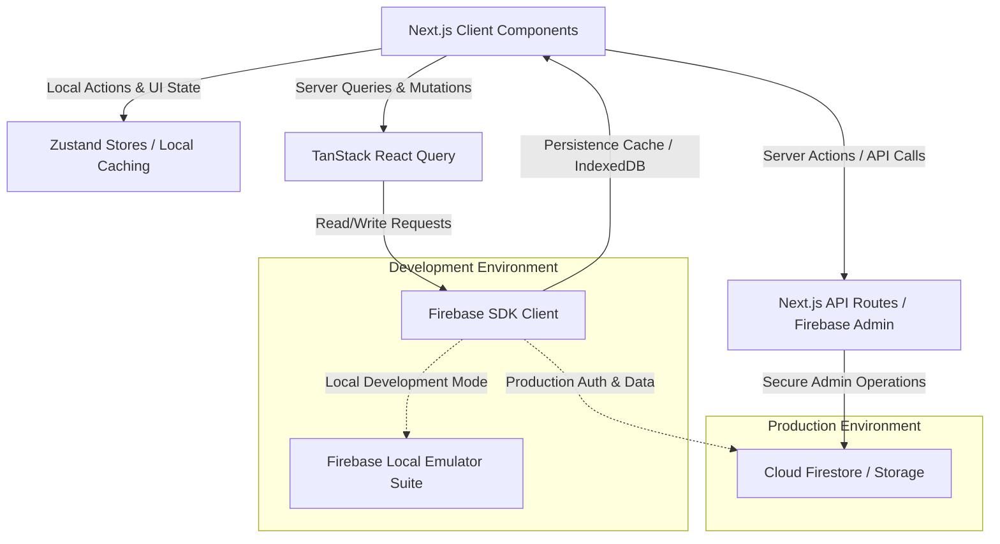

# <div align="center"><br/>One Percent</div>

<div align="center">
  <h3>Fitness Operating System — Get 1% Better Every Day.</h3>
  <p>A high-performance, keyboard-first, offline-ready fitness operating system built for long-term consistency, discipline, and measurable progress.</p>

  [](https://nextjs.org/)
  [](https://react.dev/)
  [](https://www.typescriptlang.org/)
  [](https://tailwindcss.com/)
  [](https://firebase.google.com/)
  [](https://opensource.org/licenses/MIT)
</div>

---

## 📸 Screenshots

> [!NOTE]
> *Placeholder references are defined below. Actual application screenshots can be captured and saved in `./public/screenshots/`.*

| Screen | Preview |
|---|---|
| **Login & Auth** |  |
| **Command Center Dashboard** |  |
| **Keyboard-First Workout Logger** |  |
| **Program Builder** |  |
| **Progress & Analytics Dashboard** |  |

---

## 💡 Philosophy

One Percent is not another workout tracker. It is a complete fitness operating system built around consistency, repetition, measurable progress, and long-term discipline. 

The core philosophy is simple: **Small improvements repeated daily create extraordinary long-term results.**

* **Systems Over Goals**: Instead of focusing solely on the target weight or rep count, One Percent optimizes the *system* of showing up and executing daily.
* **Compounding Fitness**: Improving by just 1% every day results in a **37.78x** improvement over the course of a single year:
  $$\text{Progress} = (1.01)^{365} \approx 37.78$$
* **Frictionless Tracking**: The application is optimized to get out of your way. Fast inputs, offline storage, and responsive layouts ensure you spend your energy on the lift, not the screen.

---

## ✨ Features

* **🔐 Authentication**
  Secure user registration, session management, and password recovery powered by **Firebase Authentication**. Integrates smooth redirection guards using Next.js Middlewares.
* **📊 Command Center Dashboard**
  A glanceable view of your weekly consistency metrics, current streaks, recent PR achievements, active programs, and progress towards daily goals.
* **🏋️ Workout Engine**
  A highly responsive tracker that manages active workout sessions, saves state dynamically, and records reps, weight, RPE (Rate of Perceived Exertion), and rest times.
* **📖 Exercise Library**
  A comprehensive, searchable repository of movements categorized by target muscle groups and equipment, with historical performance stats and quick video reference guides.
* **📋 Program Templates**
  Create, clone, and customize multi-week training plans. Schedule your progression cycles (linear, double progression, or daily undulating periodization).
* **⏱️ Integrated Rest Timer**
  Customizable rest countdowns that trigger unobtrusive audio and haptic alerts, keeping your workout pacing consistent without leaving the app.
* **🏆 Personal Records (PR) Tracker**
  Automated tracking of 1RM (One Rep Max) increases, volume records, and rep milestones across all exercises with historical progression charts.
* **📈 Progress Tracking & Analytics**
  Interactive data visualizations showing strength curves, total training volume, body weight changes, body fat metrics, and progressive overload graphs.
* **🔌 Offline-First Core**
  Local-first design utilizing **IndexedDB** caching and **Firestore Offline Persistence**. Queue modifications while offline; the app auto-syncs when connectivity returns.
* **📱 Fully Responsive Design**
  Tailored layout built mobile-first for the gym floor, scaling up elegantly to tablets and desktop screens for comprehensive data analysis.
* **♿ Built-in Accessibility**
  Semantic HTML, full keyboard navigation support, high-contrast visual cues, and ARIA labels compliant with WCAG standards.
* **⌨️ Keyboard-first Logging**
  Designed for speed. Use shortcuts and keyboard inputs to log sets, update weights, toggle timers, and complete workouts without touching the screen.

---

## 🛠️ Tech Stack

### Frontend & Core
* **Framework**: [Next.js 15](https://nextjs.org/) (App Router, Server Actions, Turbopack)
* **Library**: [React 19](https://react.dev/)
* **Language**: [TypeScript](https://www.typescriptlang.org/)
* **Styling**: [Tailwind CSS v4](https://tailwindcss.com/)
* **Components**: [shadcn/ui](https://ui.shadcn.com/) & Radix UI primitives
* **Animations**: [Framer Motion](https://www.framer.com/motion/)

### State Management & Ingestion
* **Global State**: [Zustand](https://zustand-demo.pmnd.co/)
* **Server State**: [TanStack React Query v5](https://tanstack.com/query/latest)
* **Form Logic**: [React Hook Form](https://react-hook-form.com/)
* **Schema Validation**: [Zod](https://zod.dev/)

### Backend Services & Storage
* **Auth**: [Firebase Auth](https://firebase.google.com/docs/auth)
* **Database**: [Cloud Firestore](https://firebase.google.com/docs/firestore)
* **Storage**: [Firebase Storage](https://firebase.google.com/docs/storage)
* **Admin SDK**: [Firebase Admin Node.js SDK](https://firebase.google.com/docs/admin)

### Tooling & Deployment
* **Bundler**: Turbopack
* **Tests**: [Vitest](https://vitest.dev/)
* **E2E Testing**: [Playwright](https://playwright.dev/)
* **Hosting**: [Vercel](https://vercel.com/)

---

## 📐 Architecture & Data Flow

One Percent uses a modular, **feature-based folder structure** that encapsulates domain logic while separating concerns between global layout, feature-specific actions, and external service configurations.

### Directory Structure

```text
├── app/                  # Next.js App Router Pages & Layouts
│   ├── (auth)/           # Authentication Routes (login, register)
│   ├── (app)/            # Authenticated App Routes (dashboard, training, body)
│   ├── globals.css       # Tailwind v4 Styles & Custom CSS Variables
│   ├── layout.tsx        # Global HTML Document Wrapper
│   └── providers.tsx     # Context Providers (QueryClient, Themes)
├── components/           # Reusable Presentation Components
│   └── layout/           # Global Sidebar, Navbar, and Footer
├── features/             # Feature-Scoped Domain Modules
│   ├── auth/             # Login/Signup hooks, repositories, services
│   ├── body/             # Progress photos, weight tracker modules
│   ├── dashboard/        # Analytics, consistency streaks
│   └── training/         # Workout engine, programs, exercises
├── lib/                  # Shared Utility Libraries & Configurations
│   ├── constants/        # Application Constants & Enums
│   ├── firebase/         # Client & Admin SDK Configurations
│   ├── store/            # Global Zustand Store Definitions
│   └── utils/            # Helper functions (cn, date formats)
├── public/               # Static assets (icons, SVGs, screenshots)
├── firebase.json         # Firebase Local Emulator Suite Config
├── next.config.ts        # Next.js Config
└── tsconfig.json         # TypeScript Settings
```

### High-Level Data Flow



---

## 🚀 Local Development Setup

Follow these steps to run a fully functional local development instance of One Percent, including local Firebase emulators.

### Prerequisites

* **Node.js**: `v20.0.0` or higher
* **pnpm**: `v11.0.0` or higher
* **Java Development Kit (JDK)**: `v11` or higher (required for Firebase Local Emulator Suite)

### Installation & Run

1. **Clone the repository:**
   ```bash
   git clone https://github.com/me-hv/one-percent.git
   cd one-percent
   ```

2. **Install dependencies:**
   ```bash
   pnpm install
   ```

3. **Configure Environment Variables:**
   Create a `.env.local` file in the root directory. Copy the required variables from `.env.example` or check the list below.

4. **Start the Firebase Local Emulator Suite:**
   Run the emulator in a separate terminal window to mock auth, firestore, and storage:
   ```bash
   pnpm emulator
   ```
   *The Emulator UI dashboard will be available at [http://127.0.0.1:4000](http://127.0.0.1:4000).*

5. **Start the Next.js development server:**
   ```bash
   pnpm dev
   ```
   *The application will be available at [http://localhost:3000](http://localhost:3000).*

6. **Build for Production:**
   To verify production compilation and optimize assets:
   ```bash
   pnpm build
   ```

---

## 🔒 Environment Variables

Ensure the following variables are configured in your `.env.local` file. Since we support local emulation, placeholder strings can be used during local development.

```env
# Client-Side Firebase Configurations
NEXT_PUBLIC_FIREBASE_API_KEY=
NEXT_PUBLIC_FIREBASE_AUTH_DOMAIN=
NEXT_PUBLIC_FIREBASE_PROJECT_ID=
NEXT_PUBLIC_FIREBASE_STORAGE_BUCKET=
NEXT_PUBLIC_FIREBASE_MESSAGING_SENDER_ID=
NEXT_PUBLIC_FIREBASE_APP_ID=
NEXT_PUBLIC_FIREBASE_MEASUREMENT_ID=

# Analytics & Monitoring
NEXT_PUBLIC_POSTHOG_KEY=
NEXT_PUBLIC_POSTHOG_HOST=
NEXT_PUBLIC_SENTRY_DSN=

# Server-Side Firebase Admin Credentials
FIREBASE_ADMIN_PROJECT_ID=
FIREBASE_ADMIN_PRIVATE_KEY=
FIREBASE_ADMIN_CLIENT_EMAIL=

# API & Integrations
GEMINI_API_KEY=
RESEND_API_KEY=
UPSTASH_REDIS_REST_URL=
UPSTASH_REDIS_REST_TOKEN=

# Wearable Integrations
WHOOP_CLIENT_ID=
WHOOP_CLIENT_SECRET=
OURA_CLIENT_ID=
OURA_CLIENT_SECRET=
GARMIN_CONSUMER_KEY=
GARMIN_CONSUMER_SECRET=

# Local Emulation Flag
NEXT_PUBLIC_USE_FIREBASE_EMULATOR=true
FIREBASE_AUTH_EMULATOR_HOST=127.0.0.1:9099
FIRESTORE_EMULATOR_HOST=127.0.0.1:8080
FIREBASE_STORAGE_EMULATOR_HOST=127.0.0.1:9199
STORAGE_EMULATOR_HOST=127.0.0.1:9199
```

---

## 📜 Scripts Reference

| Command | Action |
|---|---|
| `pnpm dev` | Starts the Next.js development server with Turbopack |
| `pnpm emulator` | Launches the Firebase Local Emulator Suite (Auth, Firestore, Storage, UI) |
| `pnpm build` | Compiles and optimizes the application for production deployment |
| `pnpm start` | Launches the production server locally |
| `pnpm lint` | Audits code for syntax, style, and Next.js compiler warnings |
| `pnpm lint:fix` | Automatically fixes auto-resolvable lint and style rules |
| `pnpm typecheck` | Validates TypeScript schemas and ensures static typing integrity |
| `pnpm format` | Formats all workspace files using Prettier |
| `pnpm test` | Runs the Vitest unit testing suite |
| `pnpm e2e` | Executes Playwright end-to-end user journey tests |
| `pnpm storybook` | Starts the Storybook sandbox interface |
| `pnpm analyze` | Compiles production build and launches Bundle Analyzer tool |

---

## 🗺️ Roadmap & Development Status

- [x] **Phase 1: Vision & Philosophy Definition** — Core methodology, user personas, and flow architectures.
- [x] **Phase 2: Design System & Tokens** — Implementation of Tailwind CSS v4, dark/light theme systems, and core layout.
- [x] **Phase 3: Technical Architecture** — Firebase Client & Admin SDK setup, local emulator integrations, and environment pipelines.
- [/] **Phase 4: Workout Engine** — Live session tracking, state retention, offline-first syncing, and rest pacing. *(In Progress)*
- [ ] **Phase 5: Programs & Routines** — Template constructors, multi-week progressions, and template sharing database.
- [ ] **Phase 6: Progress & Analytics** — Advanced charts, strength profiles, biometric logs, and CSV/JSON export-import.
- [ ] **Phase 7: AI Coach Integration** — Gemini LLM integration for personalized workouts, feedback, and fatigue modeling.

---

## 🤝 Contribution Guidelines

We welcome contributions from developers, designers, and writers of all experience levels! To contribute:

1. **Fork the repo** and create a feature branch (`git checkout -b feature/amazing-feature`).
2. Follow the design system tokens and maintain static typing checks (`pnpm typecheck`).
3. Format your changes before committing (`pnpm format`).
4. Write descriptive commits using Conventional Commits specification.
5. Open a Pull Request detailing the changes, visual layouts updated, and regression verifications performed.

---

## 📄 License

This project is licensed under the **MIT License**. Check out the [LICENSE](./LICENSE) file for details.

---

## 👤 Author

* **Harry Verma**
  * GitHub: [@me-hv](https://github.com/me-hv)
  * YouTube: [@ekatramusic](https://www.youtube.com/@ekatramusic)
